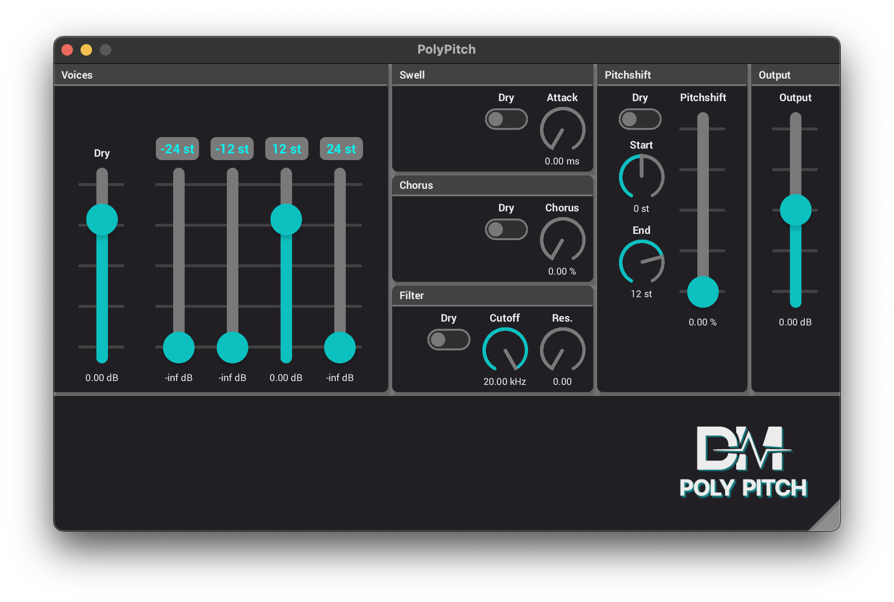

## dm-PolyPitch

This is just a small part of the code of the PolyPitch plugin. Soon to be released.

### Benchmarking

You can run the filterbank benchmark by going into the profiling directory.
And then you can run `sudo cargo bench -- filter_bank`.
Comment out the SIMD code parts [here](dsp/src/filter_bank.rs) to see how that impacts the performance when you run the bench again.
